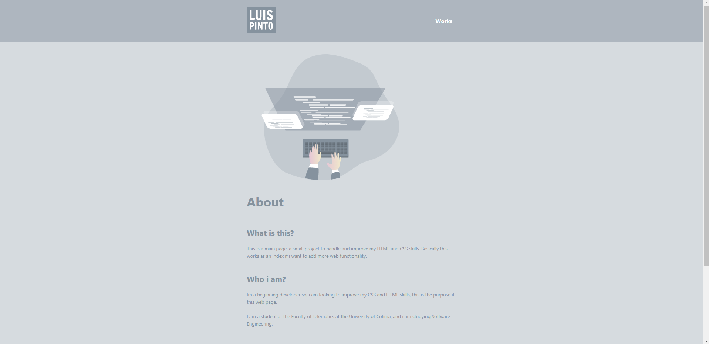
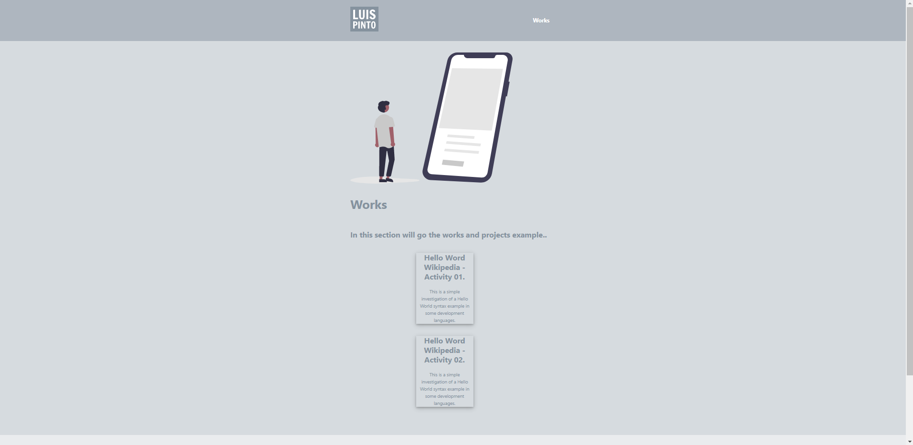

#  🦾 WebPageHTML-CSS 
**This project is a simple HTML and CSS page, basically with an index that leads you to another page.**

**This is how interface looks:**
>Looks minimalist

>Looks simple

>Looks efficient

